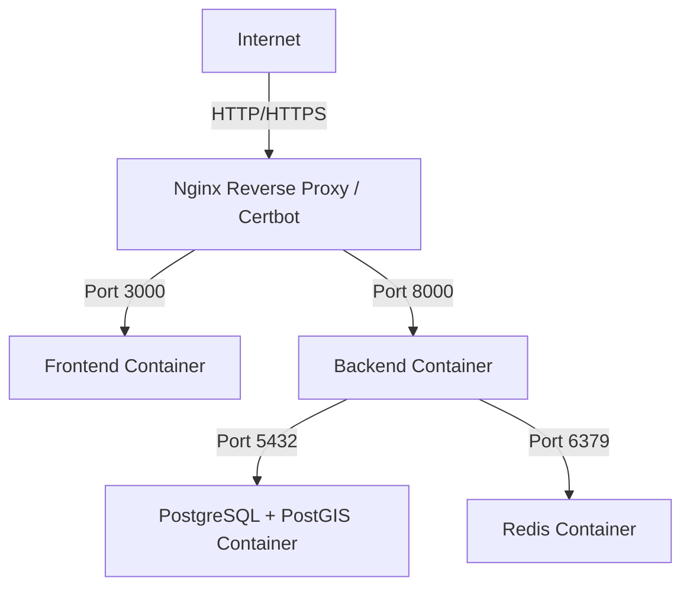

## PharmaFleet VPS Deployment Analysis

### Can it be deployed on a cheap VPS (Hostinger, etc.)?

**YES**, it is absolutely possible and often more cost-effective for smaller scales than GCP/AWS.

### Why a VPS is a good fit:

- **Docker-Ready**: Your system already has a `docker-compose.yml`, which is the ideal way to deploy on a VPS.
- **Everything in One Place**: You can run the Database, Redis, Backend, and Frontend on a single machine, eliminating the latency and cost of separate managed services.
- **Predictable Cost**: Unlike Cloud Run/Cloud SQL, a VPS has a fixed monthly price (typically $5 - $20/month).

### Resource Requirements (Estimated):

- **RAM**: Minimum 2GB (Recommended 4GB for smooth performance). PostGIS and Docker overhead benefit from the extra memory.
- **CPU**: 1-2 vCPU is sufficient for initial traffic.
- **Storage**: 20GB+ (SSD preferred).
- **OS**: Ubuntu 22.04 or 24.04 LTS.

### Proposed Deployment Architecture:

### Comparison: GCP vs. Cheap VPS

| Feature         | GCP (Current Plan)              | Hostinger VPS / Cheap VPS     |
| :-------------- | :------------------------------ | :---------------------------- |
| **Cost**        | ~$50-100/mo (Optimized)         | ~$5-15/mo                     |
| **Complexity**  | High (IAM, VPC, Cloud Run, SQL) | Low (Docker Compose + Linux)  |
| **Scalability** | Automatic Scaling               | Manual (Resize VPS)           |
| **Reliability** | Managed High Availability       | Self-Managed (Manual Backups) |

### How the Mobile App fits in:

The mobile app does NOT get installed on the VPS; it resides on the drivers' phones. However, its connection to the backend changes:

1.  **API Connection**: You will update the `baseUrl` in the Flutter app (specifically in `lib/core/constants/api_constants.dart`) to point to your VPS domain (e.g., `https://api.pharmafleet.com/api/v1`).
2.  **Push Notifications (Firebase)**: Firebase Cloud Messaging (FCM) works perfectly with a VPS. Your backend container on the VPS will securely communicate with Google's Firebase servers to send notifications to drivers.
3.  **Deployment**: You will still use your current flow for the mobile app (building the APK/IPA and distributing via Firebase App Distribution or Play Store), but the backend it talks to will now be your VPS.

### Next Steps if you choose a VPS:

1. [ ] Create a `VPS_DEPLOYMENT_GUIDE.md` with specific setup scripts.
2. [ ] Add a production-ready `docker-compose.prod.yml` with Nginx and SSL (Certbot).
3. [ ] Configure GitHub Actions to auto-deploy to the VPS via SSH.
