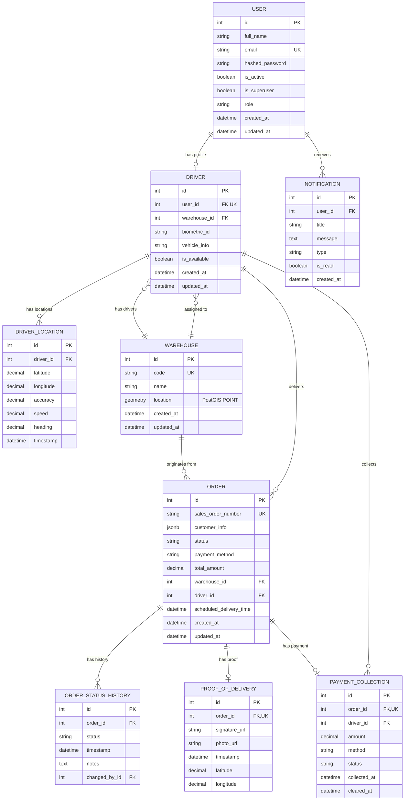

# PharmaFleet Database Schema - Entity Relationship Diagram

## Overview

This document describes the database schema for the PharmaFleet Delivery Management System.

## Database: PostgreSQL 15+ with PostGIS Extension

---

## Entity Relationship Diagram (Mermaid)



---

## Tables Detail

### 1. USER

Primary user account table for all system roles.

| Column          | Type         | Constraints      | Description            |
| --------------- | ------------ | ---------------- | ---------------------- |
| id              | SERIAL       | PK               | Auto-increment ID      |
| full_name       | VARCHAR(255) | NOT NULL, INDEX  | User's display name    |
| email           | VARCHAR(255) | UNIQUE, NOT NULL | Login email            |
| hashed_password | VARCHAR(255) | NOT NULL         | Bcrypt hashed password |
| is_active       | BOOLEAN      | DEFAULT TRUE     | Account status         |
| is_superuser    | BOOLEAN      | DEFAULT FALSE    | Super admin flag       |
| role            | VARCHAR(50)  | NOT NULL, INDEX  | Role enum value        |
| created_at      | TIMESTAMP    | DEFAULT NOW()    | Creation timestamp     |
| updated_at      | TIMESTAMP    | DEFAULT NOW()    | Last update timestamp  |

**Roles:** `super_admin`, `warehouse_manager`, `dispatcher`, `executive`, `driver`

### 2. DRIVER

Driver-specific profile linked to User.

| Column       | Type         | Constraints             | Description           |
| ------------ | ------------ | ----------------------- | --------------------- |
| id           | SERIAL       | PK                      | Auto-increment ID     |
| user_id      | INT          | FK(user.id), UNIQUE     | Link to user account  |
| warehouse_id | INT          | FK(warehouse.id), INDEX | Assigned warehouse    |
| biometric_id | VARCHAR(100) | NULLABLE                | Biometric punch ID    |
| vehicle_info | VARCHAR(255) | NULLABLE                | Vehicle description   |
| is_available | BOOLEAN      | DEFAULT TRUE            | Online/offline status |

### 3. WAREHOUSE

Warehouse/distribution center locations.

| Column   | Type                  | Constraints   | Description             |
| -------- | --------------------- | ------------- | ----------------------- |
| id       | SERIAL                | PK            | Auto-increment ID       |
| code     | VARCHAR(10)           | UNIQUE, INDEX | Short code (e.g., WH01) |
| name     | VARCHAR(255)          | NOT NULL      | Full warehouse name     |
| location | GEOMETRY(POINT, 4326) | NOT NULL      | PostGIS location        |

### 4. ORDER

Core order/delivery table.

| Column                  | Type          | Constraints                    | Description       |
| ----------------------- | ------------- | ------------------------------ | ----------------- |
| id                      | SERIAL        | PK                             | Auto-increment ID |
| sales_order_number      | VARCHAR(50)   | UNIQUE, INDEX                  | D365 SO number    |
| customer_info           | JSONB         | NOT NULL                       | Customer details  |
| status                  | VARCHAR(30)   | NOT NULL, INDEX                | Order status      |
| payment_method          | VARCHAR(20)   | NOT NULL                       | COD/Knet/Link     |
| total_amount            | DECIMAL(10,3) | NOT NULL                       | Amount in KWD     |
| warehouse_id            | INT           | FK(warehouse.id), INDEX        | Origin warehouse  |
| driver_id               | INT           | FK(driver.id), INDEX, NULLABLE | Assigned driver   |
| scheduled_delivery_time | TIMESTAMP     | NULLABLE                       | Scheduled time    |
| created_at              | TIMESTAMP     | DEFAULT NOW()                  | Import timestamp  |
| updated_at              | TIMESTAMP     | DEFAULT NOW()                  | Last update       |

**customer_info JSONB structure:**

```json
{
  "name": "Customer Name",
  "phone": "+96512345678",
  "address": "Block 5, Street 10, House 20",
  "area": "Salmiya",
  "latitude": 29.3759,
  "longitude": 47.9774
}
```

**Order Statuses:** `pending`, `assigned`, `out_for_delivery`, `delivered`, `rejected`, `returned`, `cancelled`

### 5. ORDER_STATUS_HISTORY

Audit trail for order status changes.

| Column        | Type        | Constraints           | Description       |
| ------------- | ----------- | --------------------- | ----------------- |
| id            | SERIAL      | PK                    | Auto-increment ID |
| order_id      | INT         | FK(order.id), INDEX   | Related order     |
| status        | VARCHAR(30) | NOT NULL              | New status        |
| timestamp     | TIMESTAMP   | DEFAULT NOW()         | Change timestamp  |
| notes         | TEXT        | NULLABLE              | Optional notes    |
| changed_by_id | INT         | FK(user.id), NULLABLE | Who made change   |

### 6. PROOF_OF_DELIVERY

Delivery confirmation evidence.

| Column        | Type          | Constraints          | Description        |
| ------------- | ------------- | -------------------- | ------------------ |
| id            | SERIAL        | PK                   | Auto-increment ID  |
| order_id      | INT           | FK(order.id), UNIQUE | Related order      |
| signature_url | VARCHAR(500)  | NULLABLE             | Signature file URL |
| photo_url     | VARCHAR(500)  | NULLABLE             | Photo file URL     |
| timestamp     | TIMESTAMP     | DEFAULT NOW()        | Capture timestamp  |
| latitude      | DECIMAL(10,6) | NULLABLE             | GPS latitude       |
| longitude     | DECIMAL(10,6) | NULLABLE             | GPS longitude      |

### 7. DRIVER_LOCATION

Real-time GPS tracking data (partitioned by date).

| Column    | Type          | Constraints          | Description           |
| --------- | ------------- | -------------------- | --------------------- |
| id        | BIGSERIAL     | PK                   | Auto-increment ID     |
| driver_id | INT           | FK(driver.id), INDEX | Related driver        |
| latitude  | DECIMAL(10,6) | NOT NULL             | GPS latitude          |
| longitude | DECIMAL(10,6) | NOT NULL             | GPS longitude         |
| accuracy  | DECIMAL(6,2)  | NULLABLE             | GPS accuracy (meters) |
| speed     | DECIMAL(6,2)  | NULLABLE             | Speed (km/h)          |
| heading   | DECIMAL(5,2)  | NULLABLE             | Direction (0-360)     |
| timestamp | TIMESTAMP     | NOT NULL, INDEX      | GPS timestamp         |

**Partitioning:** Range partition by `timestamp` (daily partitions)

### 8. PAYMENT_COLLECTION

COD and payment tracking.

| Column       | Type          | Constraints          | Description       |
| ------------ | ------------- | -------------------- | ----------------- |
| id           | SERIAL        | PK                   | Auto-increment ID |
| order_id     | INT           | FK(order.id), UNIQUE | Related order     |
| driver_id    | INT           | FK(driver.id), INDEX | Collecting driver |
| amount       | DECIMAL(10,3) | NOT NULL             | Amount in KWD     |
| method       | VARCHAR(20)   | NOT NULL             | Payment method    |
| status       | VARCHAR(20)   | NOT NULL             | pending/cleared   |
| collected_at | TIMESTAMP     | DEFAULT NOW()        | Collection time   |
| cleared_at   | TIMESTAMP     | NULLABLE             | Clearance time    |

### 9. NOTIFICATION

In-app notifications.

| Column     | Type         | Constraints        | Description        |
| ---------- | ------------ | ------------------ | ------------------ |
| id         | SERIAL       | PK                 | Auto-increment ID  |
| user_id    | INT          | FK(user.id), INDEX | Target user        |
| title      | VARCHAR(255) | NOT NULL           | Notification title |
| message    | TEXT         | NOT NULL           | Notification body  |
| type       | VARCHAR(50)  | NOT NULL           | Notification type  |
| is_read    | BOOLEAN      | DEFAULT FALSE      | Read status        |
| created_at | TIMESTAMP    | DEFAULT NOW()      | Creation time      |

---

## Indexes

### Primary Performance Indexes

```sql
-- Order lookups
CREATE INDEX idx_order_status ON "order" (status);
CREATE INDEX idx_order_driver_id ON "order" (driver_id);
CREATE INDEX idx_order_warehouse_id ON "order" (warehouse_id);
CREATE INDEX idx_order_created_at ON "order" (created_at DESC);
CREATE INDEX idx_order_status_warehouse ON "order" (status, warehouse_id);

-- Driver lookups
CREATE INDEX idx_driver_warehouse_id ON driver (warehouse_id);
CREATE INDEX idx_driver_is_available ON driver (is_available);

-- User lookups
CREATE INDEX idx_user_role ON "user" (role);
CREATE INDEX idx_user_is_active ON "user" (is_active);

-- Location tracking (partitioned table)
CREATE INDEX idx_driver_location_driver_timestamp ON driver_location (driver_id, timestamp DESC);

-- Payment tracking
CREATE INDEX idx_payment_driver_status ON payment_collection (driver_id, status);
CREATE INDEX idx_payment_status ON payment_collection (status);

-- Notifications
CREATE INDEX idx_notification_user_unread ON notification (user_id, is_read) WHERE is_read = FALSE;
```

### Geospatial Indexes (PostGIS)

```sql
-- Warehouse location spatial index
CREATE INDEX idx_warehouse_location ON warehouse USING GIST (location);
```

---

## Database Roles

| Role                   | Permissions                    | Usage                          |
| ---------------------- | ------------------------------ | ------------------------------ |
| `pharmafleet_admin`    | ALL PRIVILEGES                 | Schema migrations, admin tasks |
| `pharmafleet_api`      | SELECT, INSERT, UPDATE, DELETE | Application API access         |
| `pharmafleet_readonly` | SELECT                         | Reporting, analytics           |
| `pharmafleet_backup`   | SELECT                         | Backup operations              |

---

## Connection Pooling Configuration

**PgBouncer recommended settings:**

```ini
[databases]
pharmafleet = host=localhost port=5432 dbname=pharmafleet

[pgbouncer]
pool_mode = transaction
max_client_conn = 500
default_pool_size = 25
min_pool_size = 5
reserve_pool_size = 5
reserve_pool_timeout = 3
```

---

## Backup Strategy

- **Daily Full Backups:** pg_dump at 02:00 UTC
- **Continuous WAL Archiving:** For PITR
- **Retention:** 30 days for daily backups, 7 days for WAL
- **Offsite Replication:** Azure Blob Storage / AWS S3

---

## Version Information

| Component      | Version    |
| -------------- | ---------- |
| PostgreSQL     | 15.x       |
| PostGIS        | 3.3.x      |
| Schema Version | 1.0.0      |
| Last Updated   | 2026-01-22 |
